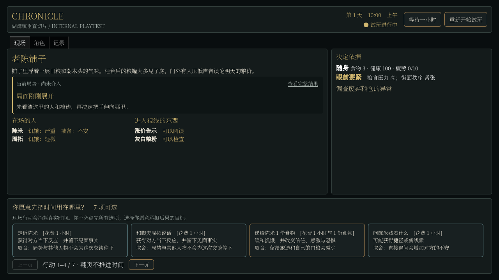
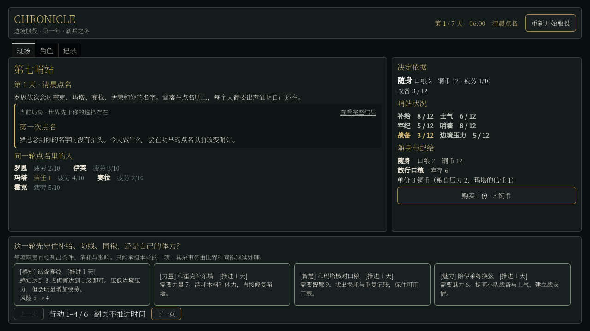

# 美术归档、界面统一与投影优化

日期：2026-09-05。当前阶段仍为 H1，未宣布可玩 Demo 或自主经济闭环完成。

## 这轮改善

正式美术已经归入专用目录，后续不能随意散放。湖湾镇、第七哨站和生成世界共用顶栏、面板与控件样式；哨站现在可以在现场购买补给并看到反馈，重新开始前需要确认。现场结果可以直接打开完整记录，再返回原来的阅读位置和键盘焦点。继续推进时还修掉了决策摘要重复生成投影的问题，第七日世界的只读刷新有可测量的降耗。

这次没有新增剧情、人物行为、生产规则或美术画面，不把 UI 整理与运行效率当作涌现程度提升。

## 美术目录

- 新入口为 `chronicle-godot/art/`，说明见 [art/README](../../../../../art/README.md)。正式分类是 environments、fonts、icons。
- 三项正式媒体为苇岸地点画、思源宋体、Godot 占位图标。原样迁移并保留 UID；同步更新项目字体/图标、场景字体、地点画引用及导出脚本。
- 21 项备用媒体集中复制到 `art/reference/legacy/`，包括图标、贴图、音频和备用字体。原 `素材包/` 完整保留，副本逐项校验 SHA-256；相关原始说明文件也保留。
- 备用副本用 `.gdignore` 隔离，并在 Windows 导出中明确排除。现有授权说明不能覆盖整个备用库，本轮没有接入这些音效，也没有把它们作为正式参赛资产。
- `catalog.json` 记录来源、发布状态、字节数和哈希。导出前检查缺失、散放、未登记改动、备用副本一致性及禁止引用；六组校验器正反例测试通过。
- 历史项目和报告截图不属于当前制作资产，仍在各自归档与证据目录。没有搬走或清理历史文件。

## UI 的实际变化

两处过去已经共享分页骨架，但仍有不同的顶栏、默认按钮皮肤和信息入口。此次将通用结构与语义样式集中到 SharedWorldSurface/SharedInterfaceStyle，不再给两处各配近似样式。

现场按“地点、刚发生的结果、在场人物、决定依据、行动”阅读。角色属性留在角色页，完整历史在记录页滚动。旧切片的阶段计数和长目标说明移到记录，眼前目标、行动成本和风险保留在现场；哨站不再将补给交易藏在角色页。

“查看完整结果”位于反馈标题行；普通导航不推进世界时间，不执行行动，返回时恢复焦点。哨站重置会说明当前阶段进度丢失的后果，默认焦点在取消；取消不改变完整世界状态，确认后仍按原有阶段规则重启。

首次加入结果按钮时，长调查与档房结果使 720p 顶栏和分页溢出。实际路线回归发现后，改成标题行内的记录链接，统一紧凑分页间距，再次通过完整路线。没有删掉行动正文、风险说明或完整结果。小窗口和大字号的无限内容容量仍未全面解决，不以这次截图声明所有状态都已覆盖。

湖湾镇与第七哨站仍是历史回归切片，时间尺度、可执行行为和阶段规则没有被强行改成相同。正式生成世界保留已有保存/读档/新世界入口，旧切片此次没有新增对应存档按钮；统一的是界面结构、样式和共同操作，不是宣布三个模式功能完全一致。

## 性能推进

复用前轮 `world_runtime_probe/day7.json`，没有重跑七日模拟。真实 build_view_data 通过计时用 SnapshotBuilder 子类统计调用，不替换结果或修改模拟。每个世界测 20 次完整投影，组件探针各 5 次；组件包含重叠调用，不能把它们直接相加。

发现 `_decision_view` 重做已经投影过的行动、路线、风险和局势。修复仅复用本次 build_view_data 的局部结果，返回后没有跨行动缓存。两种子、两个场景的初始状态、帮助/旅行、过期行动和等待后完整视图与原行为对照一致；清空返回数组不污染下一次投影。

| 同进程温态只读对照 | 初始世界 | 第七日世界 |
| --- | ---: | ---: |
| 未复用结果：P50 / P95 | 89.48 / 111.99 ms | 536.38 / 568.03 ms |
| 复用结果：P50 / P95 | 38.50 / 39.24 ms | 302.46 / 315.75 ms |
| 每次完整投影构造快照 | 34 → 18 次 | 36 → 19 次 |

第七日投影 P95 约降低 44%。原始数据见 [projection_after.json](ui_art_evidence/projection_after.json)；首次探针见 [projection_before.json](ui_art_evidence/projection_before.json)。该样本不包含世界 tick、GPU 帧、存档或完整行动延迟，也不是冷启动时间。没有删除历史、减少居民或降低真实结算量。

下一优先项是测量完整行动并继续定位剩余快照、名称查询、候选和全局 tick 成本。H1 的“初始/七日各 20 次合法行动 P95 不超过 1 秒”和包含进程加载的冷启动门槛仍未验收；H2 的可持续收入/消费/运输链也未完成。

## 验证与构建

- 九个定向 Godot 测试文件通过，其中新统一界面 GPU 检查 42/42、投影复用一致性 72/72；包括哨站插曲渲染、人物属性、旅行、阶段确认与旧路线 UX。
- 生成世界另跑 Compatibility 渲染和原生存读档 54/54，含跨镇后连续性、坏存档保留、种子重启和工作线程拒绝重复提交。
- 资产检查通过，校验器测试 6/6；源码与打包后后台进程协议分别 7/7。
- Windows EXE/PCK 重新导出并实际启动，正式图、字体和图标出现在导出记录中，备用目录未出现。构建在 `builds/h1-windows/`，说明和许可证同步更新。
- 全部界面证据来自程序驱动的真实 Godot 渲染，不是人工高强度试玩。长反馈与指定插曲覆盖使用测试注入，不能当作自然事件发生频率的证据。没有做干净机器或三位非开发者验收，也没有录制参赛演示。

复现入口：`tests/run_regression.ps1` 的定向 Filter、`tests/rebuild/world_demo_surface_test.gd`、`tools/test_art_assets.py`、`tools/world_projection_profile.gd`、`tools/export_windows.ps1`。性能探针默认复用本机前轮第七日存档，也可在 `--` 后传入同类型原生存档路径；缺失时明确失败，不假造历史。各项原始结果保留在 [ui_art_evidence](ui_art_evidence/)。
