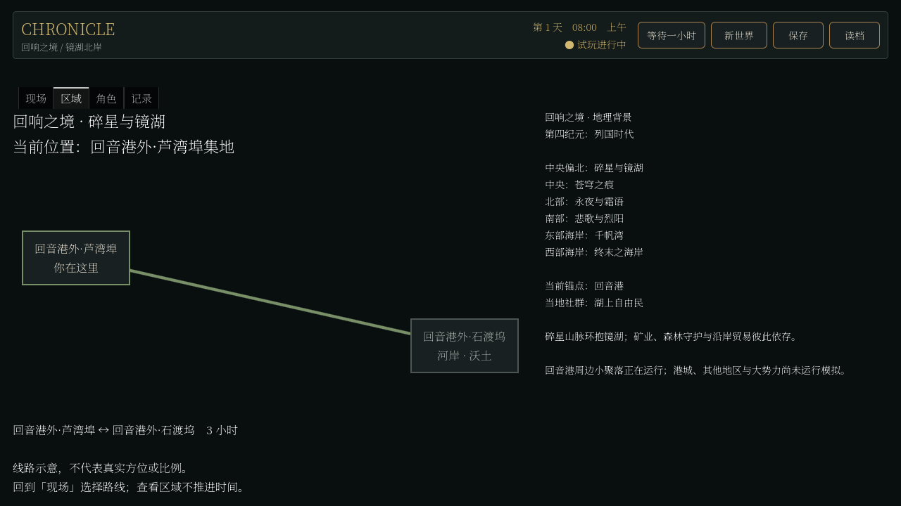

# 原设定世界回接与居民购粮

日期：2026-09-05。当前分支 `codex/player-agency-world-surface`。这是运行基础与因果机制报告，不是可玩 Demo、完整经济或文明涌现验收。

## 结果与意义

世界身份已经接回用户早期设定。原来的合成三镇不再承担正式世界地理；新世界在回响之境的镜湖北岸、回音港周边生成两个小聚落，使用同一会话、时间与原生存档。六界域、17 个势力及历史锚点进入带来源的目录，远方与国家政治尚未运行。

同时完成真实寻粮子机制。饥饿者能够因已知供给地点而出行，在同处遇见有余粮者时付款取粮，随后实际进食；食物和铜币不会因叙述凭空增减。生存闭环仍不成立：有人持续饥饿，同时别人囤有大量食品。下一项应处理家庭供给、收入来源和生产用途，不应继续堆地名或事件文案。

## 原设定依据

核查了早期编年史、势力总表、六区设定、镜湖生态与森林带数据，并对照 v2 和 v4 目录中的 GDD。原编年史本来就要求固定主干与生成地方细节。详细入口、六区摘要、生成边界及三处冲突见 [原设定衔接合同](../../../../../../texts/v5/CHRONICLE_CANON_WORLD_FOUNDATION_v5.1.md)。八份主来源的路径和哈希见 [来源记录](canon_food_evidence/canon_source_hashes.json)。

湖湾镇、第七哨站未在本轮阅读的原始地区与势力资料中找到同名锚点，保留代码、存档和回归用途，不擅自改名为回音港或矮人哨站。无归之岛的东西海岸冲突、中央区与镜湖边界重叠、西海岸湿地命名分歧均保留未决；本轮实现不依赖它们，因此不需要阻塞全部工作等待裁定。

正式运行样本的 16 人、两处场址、田地与芦苇数量、三小时道路和金库都是实现参数，不是原稿中的精确设定。当前沿用通用居民和职业，还没有实现湖上自由民的完整种族、语言和文化差异。回音港本城、矮人王国与林精议会不因存在名称就成为活动实体。

## 购粮机制与边界

- 食品作业调整为四小时到岗劳动对应十二份食品，保留原资源扣减；这是作业批次与餐份的游戏单位校准，不是现实农业或《矮人要塞》的数值结论。
- 不新增开局口粮与货币。成年人根据饥饿、实际资金、休息需要及已知本地/相邻供给地点安排寻粮。
- 知道职业与供给地点，不知道远方实时库存和价格；此处仍使用共同职业名录抽象，不是完整的知识传播模型。
- 到场且非途中才能交易，私人住宅不充当自动公共市场，卖家保留两份食物。实际商品与付款走原有 MarketService、事务 Writer、ItemStore 和 ExchangeStore。
- 失败分为无可见余粮与付不起；同一失败短时间不重复刷屏。新的当面余粮可改变结论，不会被过期的“没货”记录永久锁住。
- 买到不等于吃掉。原有进食规则随后扣除食物，来源可追溯到交易；自己随身携带的口粮可以在途中食用，家庭援助仍须同处。
- 没有用国家势力目录接管现有经济权属。聚合运输配额仍不等同成品物流；个人跨镇买粮也不等于大宗货运闭环。

## 七日无人干预

以下均通过正式场景启动后逐小时推进，不执行旅人的行动或旅行。期末完整引用审计、原生磁盘存档和续跑一小时通过。这里是七日样本，不是 B6 三十日验收，也不是人类游玩。

### 合成三镇回归样本

| 种子 | 居民 | 产出餐份 | 实际进食 | 余粮 | 购粮次数 / 跨镇 | 期末极饿 |
| --- | --- | --- | --- | --- | --- | --- |
| 81001 | 30 | 420 | 189 | 231 | 18 / 13 | 17 |
| 82002 | 30 | 420 | 228 | 192 | 19 / 17 | 21 |
| 83003 | 30 | 576 | 228 | 348 | 15 / 15 | 14 |

食品质量账差额均为零，铜币总量分别维持 440、432、429。购入后实际被吃掉且引用交易的餐份为 28、28、22。与前轮 51 份生产相比，产量校准和寻粮同时改变，不能把全部改善归于采购。

因此保留同种子、同食品批量的反例：只将“知道相邻供给地点”关闭，属于**测试注入**。81001 的本地知识版本成交 5 次、消费 176 餐；相邻知识版本多消费 13 餐，极饿人时从 2686 降到 2548，约少 5.1%，但期末极饿仍是 17 人。这证明信息和可达性有实物后果，不能证明生活已经可持续。

### 回音港外正式锚点样本

| 种子 | 居民 | 产出餐份 | 实际进食 | 余粮 | 购粮次数 / 跨镇 | 期末极饿 |
| --- | --- | --- | --- | --- | --- | --- |
| 81001 | 16 | 468 | 193 | 275 | 0 / 0 | 2 |
| 82002 | 16 | 468 | 193 | 275 | 1 / 0 | 2 |
| 83003 | 16 | 468 | 193 | 275 | 1 / 0 | 2 |

铜币总量分别保持 301、288、279，食物账差额为零。三个种子存在不同人物状态和少量交易差异，但聚合生存结果相同。这是需要继续改善人物处境与相互依赖的证据，不以随机姓名或日志差异宣布“丰富涌现”。较少饥饿者也不是单变量优化结果，人口与资源配置均已改变。

进一步核查 81001 的 `generated_household.echo_terrace.02`：高桑和高砚各吃过 14 餐，期末分别持有 7 与 11 枚铜币；同户退休者高遥、高岑各为零餐、无随身食物、极饿。`resident_daily_life_system.gd` 的 `_food_goal` 仅检查行动者自己的食物需求，无法为家人安排采购。家庭缺少实物带回的目标是优先诊断点，不能直接把这一案例归因于整个家庭没钱，或再提高世界产量。

各样本的 `*_audit.json` 与 `*_run.json` 位于 [证据目录](canon_food_evidence)。审计由 `tools/audit_resident_life.py` 离线读取存档，不重跑世界、不修改世界。哈希标识当时保存文件，保存时间等元数据可能令重新生成的文件哈希不同；机制复现比较实际状态和原生续跑，不比较不同时间生成的文件哈希。

## 界面与性能

默认新世界、区域背景、两地合法旅行和到达标记已做 1280×720 实际 Compatibility 渲染检查。当前锚点与六区背景全部展开，未添加嵌套滚动小框；原型苇岸画没有挪作回音港专属美术。截图为程序驱动的真实 Godot 画面，不是人工游玩或概念效果图。



购粮回显由合法观察者旅行与等待触发观看，显示实际姓名、物品、数量和铜币，不再只有“记住了关键信息”一类空反馈。本轮没有重做完整人物决策 UI，当前合法行动仍然单薄。

合成三镇七日存档的渲染行动测量中，最初并发负载样本不能用于验收。后来单独运行的初始/第七日各 20 次普通操作，P95 为 **336 / 1217 ms**，最慢 **372 / 1772 ms**。第七日未达到 1 秒门槛，不能以探针输出 PASS 冒充性能达标；该 PASS 仅表示合法操作、引用与布局检查没有失败。拆分数据显示两个尖峰分别在投影和结算，见 [完整样本](canon_food_evidence/food_access_quiet_final.json)。

库存读取缓存只限当前小时/当前调用，没有跨行动缓存世界状态。此前隔离缓存改动时的 40 步完整状态与视图哈希相同；不同人口、资源和历史规模间的耗时差不作为代码提速百分比。

回音港 16 人样本另行单独运行，初始/七日各 20 次普通操作 P95 **181 / 519 ms**，最慢 **191 / 528 ms**，本机这一范围满足响应门槛。它不消除上述 30 人负载问题，也不是同世界优化对照。样本见 [锚点范围响应](canon_food_evidence/canon_quiet.json)。

## 验证与复现

原设定合同覆盖引用、版本、地形、资源、作用域、旧世界隔离与完整原生续跑；食品合同覆盖实际转移、付款、消耗、保留粮、远程/途中/死亡/无款反例。完整回归摘要与最终包内后台验证记录随本次检查点归档，常规套件不含三十日长测。

完整常规回归 **132/132 通过**，包含实际渲染测试。原设定合同随后补测同种子完整状态复现，最终 **106/106**；食品合同 **59/59**。源码真实进程协议 **8/8**，包括原设定的旁观推进、合法等待及存读档。最终 Windows 包验收另列证据；没有独立人类试玩。

```powershell
.\chronicle-godot\tests\run_regression.ps1 -Godot (Get-Command Godot_v4.6.3-stable_win64_console.exe).Source -Render -OutputDirectory builds/validation/canon_food_regression
Godot_v4.6.3-stable_win64_console.exe --headless --path chronicle-godot --script res://tools/food_economy_probe.gd -- canon 81001 7
Godot_v4.6.3-stable_win64_console.exe --headless --path chronicle-godot --script res://tools/food_economy_probe.gd -- final 81001 7
Godot_v4.6.3-stable_win64_console.exe --headless --path chronicle-godot --script res://tools/food_economy_probe.gd -- local_only 81001 7
```

AI 协议新增 `scenario="echo_realm"`，支持旁观推进、正式行动和独立存档命名空间。已有协议默认仍是 `generated_network` 以免破坏旧调用，正式 UI 的新世界默认改为原设定；旧 UI 手动存档仍原样继续，不静默转换。

## 计划更新与未完成项

Agent 入口、项目 Skill、创作指导和唯一活动计划已加入来源优先级及原型隔离。Skill frontmatter 校验通过；实际执行采用原稿明确的北岸范围，遇到远方冲突先隔离而非编造答案。这不证明更换模型就自动改善所有开发质量。

当前 H2 下一项为余粮分配、家庭同处与真实工资来源，再接镜湖原设定中粮食、工具和准入的依存关系。没有把本轮数据目录计为文明摩擦，也没有提高 Steam Demo 完成度。多种族生活、远方模拟、持续收入、危险出行、独立人测、美术完整性、声音及参赛视频均仍未完成。
