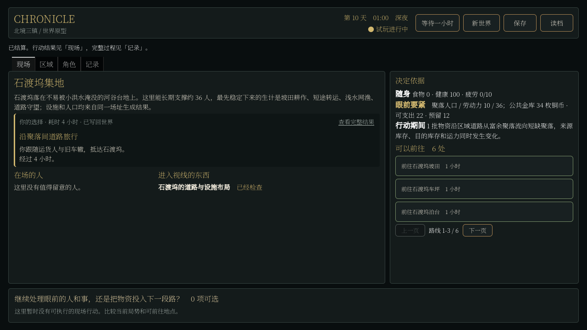

# H1 行动响应与历史隔离

日期：2026-09-05。普通操作响应和打包启动的本机样本已达到 H1 预算，回归及源码/包内控制协议验证通过。本轮没有完成 H2，也没有把速度提升当作涌现或可玩性提升。

## 本轮结果

事务预检原来会深拷贝完整事实历史，以及按 ID、类型建立的历史索引。第七日五次微探针中，全部 Store 预览构造约 20 至 24 毫秒，其中事实 Store 的一次属性复制约 9 至 15 毫秒。一个世界结算包含多次预检和提交，这份成本会反复出现。

现在事实在入库时递归只读，事务副本独立持有数组和索引容器，共享已经不可修改的历史字典。公开可编辑查询仍返回深拷贝，存档载入重新建立只读保护。没有跳过预检、回滚、资源校验，也没有删历史、缩减居民或改变模拟频率。未知 Store 和 FactStore 子类仍走原来的通用复制路径。

另一处局部修改把现成快照传给名称查询，避免为几个名字重新构建整份世界快照。没有建立跨行动缓存。

## 普通行动

使用真实 Compatibility 渲染和正式世界 Viewer 的异步操作入口，从发起操作计时到结果页面绘制完成。种子 81001，初始世界与此前无人干预产生的第七日原生存档分别执行 20 次合法操作，含查看地点、镇内一小时移动和等待。操作策略未根据耗时跳过慢步骤，跨日结算也保留。

| 起点 | 优化前 P50 / P95 | 优化后 P50 / P95 | 优化后最慢 |
| --- | ---: | ---: | ---: |
| 初始世界 | 221 / 371 ms | 144 / 225 ms | 316 ms |
| 第七日世界 | 969 / 1232 ms | 732 / 859 ms | 1285 ms |

40 个步骤逐一比较完整 Stores、Session、时间、RNG、世界日志与完整视图的原生全精度 JSON 哈希，全部一致。只比较相同输入与相同历史，未把不同负载下的组件微测量相加。原始行包含行动 ID、位置、模拟小时、操作与投影分项、帧数、哈希，见 [证据目录](h1_response_evidence/)。

第七日普通行动的样本 P95 降低约 30%。最慢的一次仍超过一秒，因此这不是“所有操作都在一秒内”的承诺，也不是所有种子、设备和第三十日的性能验收。

## 长途与启动

另外各执行 20 次操作，优先选择苇岸埠与石渡坞之间的四小时路线。第七日这组混合操作 P95 为 2310 ms，最慢 2418 ms；七次长途过程中分别绘制了 211 至 293 个 UI 帧。没有将耗时除以模拟小时伪装成达标。工作线程运行时界面显示实际已用秒数并拒绝重复提交，不伪造完成百分比。

打包后的 EXE 新进程启动，初始世界和第七日存档各测三次，实际绘制第一帧并确认操作启用之后发出标记。初始约 1.66 至 2.05 秒，第七日约 2.49 至 2.65 秒。计时包含进程、资源与存档加载；测试使用独立路径，不读取或覆盖玩家手动存档。没有清空系统文件/着色器缓存，不能称为冷磁盘或独立机器验收。

首次启动探针错误地从精简 UI 时间字段读取不存在的累计小时，导致续档验证误报。已改用 Session 的真实时间摘要；存档本身正常恢复，保留严格的第七日检查，没有改成仅检查 ready。

## 历史与回归

新增事实历史隔离测试 20/20，覆盖嵌套只读、调用者修改、公开副本、预检未提交、提交后副本清空、失败批次前序事实回滚、索引隔离和重复 ID。原有投影一致性、资源权限、付款、物品、原生存档和界面合同也纳入完整回归。

完整回归发现一条旧调查测试仍要求长目标说明在现场页可见。此前 UI 已把长说明放入记录，此次把测试改为通过“查看完整结果”打开记录检查状态，再返回现场检查调查控件；没有删除可访问性要求。

完整常规回归首次为 125/126；修正上述过时的界面预期后单独复测通过，合并结果为 126/126。另行使用真实 GPU 运行世界界面测试，63/63 检查通过，包含操作期间实际已用时提示。没有运行独立的三种子三十日健康探针。

重新进行了七日无代理行动模拟，引用审计、磁盘存读档及续跑一小时按原生精度一致，未通过界面或测试注入插入人物行为。第一日/第七日单日结算约 1.67/8.23 秒，仅作为新基线，不与历史不同负载下的单次耗时计算加速比。源码和重新导出的 Windows 包各通过 7/7 真实进程协议测试，素材导出检查通过。

## 新发现与顺序

第七日原生存档包含 30 名生成居民，30 人的位置仍是住屋、0 人被标为可见；15 名有工作者的位置不在工作地点。代码中的职业生产没有到场前置条件。截图中“没有值得留意的人”和行动耗尽并不只是排版问题。

因此 H2 的收入、消费和运输必须与人物到场和需求一起推进。先建立可追溯的出门、到达、工作/补给、返回或未成行，生产读取同一位置与时间约束，再让真实成品、付款和消费串起来。不能只把 visible 改为 true，也不能新增一批人在集地循环播报。现有 30 人基线保持不变，本轮没有暗中压到计划所限定的参赛规模。

复现入口：`tools/world_action_profile.gd`、`tools/world_cost_breakdown.gd`、`tools/profile_windows_startup.py`。第七日存档以压缩包保留，哈希见 `presence_audit.json`。程序驱动 UI、无人干预原始存档和测试注入分别记录；没有人工高强度试玩或外部玩家验收。
