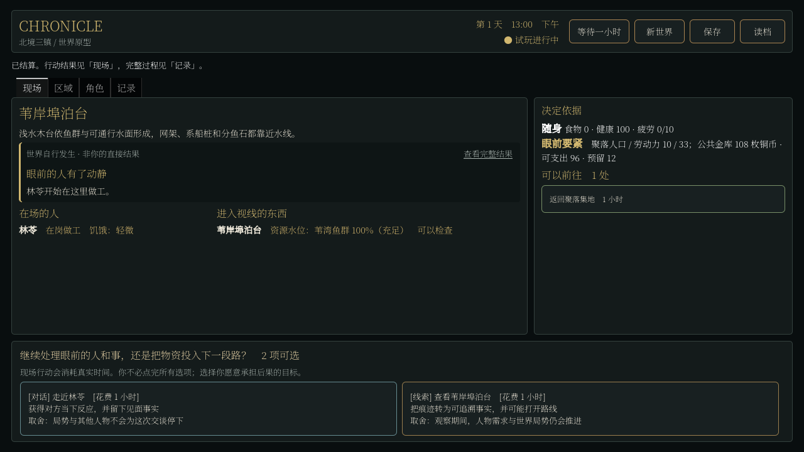

# H2 居民到场与生活缺口

日期：2026-09-05。完成了人物位置与到岗的前置合同，尚未完成 H2 的自主经济闭环。世界的空间与时间因果更可信，但实际生存平衡更差，不能据此提高涌现或可玩 Demo 的完成度。

## 现在能看到什么

新建正式生成世界后，居民会自行从住屋出门、经过集地、到达工作地点，劳动后返回住处休息。白天工人与守夜人有不同班次，未就业者会去集地寻找工作。现场显示真正到达的人，并优先回显眼前的抵达、离开和开工，不再让远处一笔自然资源恢复压过本地人物动向。

这张图来自程序驱动正式 UI 的等待与合法旅行，没有把人物位置直接注入现场；不属于人工高强度试玩。新规则与 UI 共用正式 Session，后台观察模式同样发生这些活动。

## 到场不是装饰

人物保存分段旅程与剩余小时，在途中和刚抵达的小时不能劳动。实际工作地点、职业地点、班次、健康与疲劳条件同时满足后，才累计生产工时；原有资源权限、有限库存和真实薪酬付款照常检查。工作产物引用最近到达事实，换岗不会把另一种工作的部分工时带过来。

断路时不能出发，途中阻断保留尚未走完的路，不免费返回或传送到终点。道路恢复后继续走完。家庭和邻里只能向同处一地的人分享实际持有的食物，不能隔着地点直接取走家人的随身库存。

这里仍是小时级地点图。既有迁居、组织采购和聚合运输还没有全部改成逐段人物物流；作息也不是完整的人生目标规划。完整边界见 [居民位置与到岗合同](../../../../../../texts/v5/CHRONICLE_RESIDENT_DAILY_LIFE_CONTRACT_v5.1.md)。

## 负面结果

同一种子 81001、同为七日无人干预的原生存档，离线核对实际食品收支：

| 指标 | 旧规则 | 新到岗规则 |
| --- | ---: | ---: |
| 生成居民 | 30 | 30 |
| 七日实际生产食品 | 174 份 | 51 份 |
| 七日实际食用 | 173 份 | 51 份 |
| 剩余食品 | 1 份 | 0 份 |
| 第七日结束极度饥饿 | 19 人 | 29 人 |

新规则另一种子 82002 同样生产并吃掉 51 份食品，29/30 人极饿。两种子有不同人物与活动分布，但不能把同样的食物崩溃当作有趣的差异。

当前需求规则每六小时加深一级饥饿，一餐缓和两级。30 人稳定维持的参考量约为每日 60 餐；这是按规则计算的收支参考，不是实际吃下的数量或对每一天精确需求的估计。两个新存档都无初始食物储备，实际产量远低于这个参考；停止全天自动生产后，缺口进一步扩大。同处一地的分享约束也减少了原来的远程援助。不能将这个整体差异只归因于某一条单独改动。

聚合粮食资源充足不代表人物拥有可食用口粮。现有产业选择甚至会让缺饭的聚落有人转去制绳；生产目标还没有读取同一套真实家庭口粮需求。这是下一阶段必须补的供需和处境反馈，不新增几条固定“饥荒事件”来掩盖。

## 验证与兼容

- 新增居民合同 85/85 检查，包括无人指挥出行、到岗、夜班、休息、途中中断/恢复、换岗、同处食物援助、坏旅程存档拒绝和真实旧存档保留。
- 常规完整回归首次 124/128。三项失败来自旧定义数量断言，一项暴露真实旧存档的定义清单兼容问题。同步精确数量并实现明确版本迁移后，复测四项均通过；另复测受界面回显影响的渲染、投影一致性和世界存读档，合并为 128/128。没有把失败日志删掉。
- 内容包 v4 只按 v1/v2/v3 的精确历史清单迁移。实际 H1 第七日存档与此前经济合同保留的旧三十日样本均能加载。v3 到 v4 不改 Stores、库存、人物作息或历史；旧 v1/v2 绳索迁移仍按原合同执行。旧存档继续旧规则，新建世界才启用作息 v1。
- 两种子各七日无人干预，第一日/第七日引用审计、原生磁盘保存与续跑一小时通过。没有运行三种子三十日健康验收，也没有验证经济可持续性。
- 真实 Compatibility 渲染下，种子 81001 初始和新规则第七日各 20 次合法普通操作，P95 为 250/488 ms，最慢 324/785 ms。新世界产出物更少，不将它与 H1 旧世界耗时比较成新的优化收益。
- 源码与实际 Windows 包各通过 7/7 进程协议测试，美术边界测试 6/6、导出检查通过。所有新截图是报告证据，本轮未添加正式美术或声音。

证据保存在 [h2_presence_evidence](h2_presence_evidence/)，包括两种子原生检查点、食物收支、响应逐步数据、原始与复测日志。离线食物审计入口为 `tools/audit_resident_life.py`，不运行或修改世界。

## 下一项决策

当前唯一待推进内容是实际口粮的生产、购买、分配和运输，衔接原有经济所有权合同。需要确定默认新世界的生活基线：先可正常谋生、有有限储备，再由资源与道路变化打破平衡；还是一开始就长期处于物资紧张的求生处境。建议前者，保留危机开局作为后续变体；这是建议，尚未当作用户已选定的方向改动产量、价格或初始储备。
