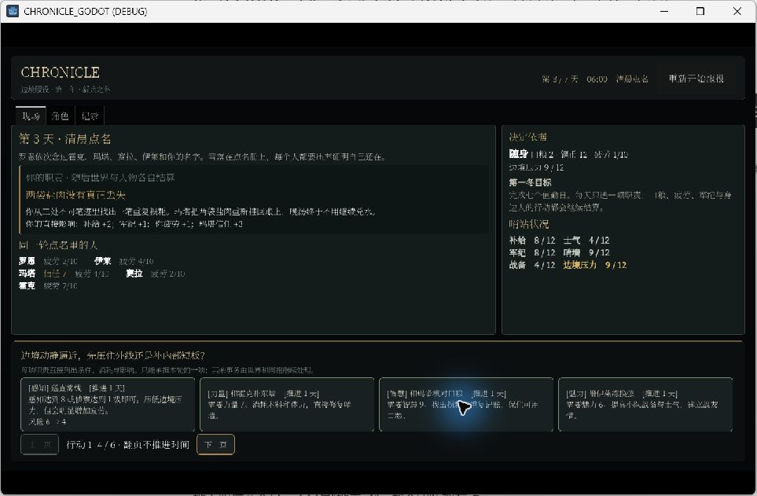
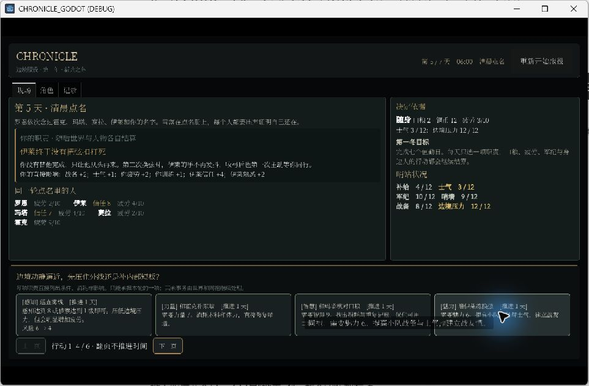
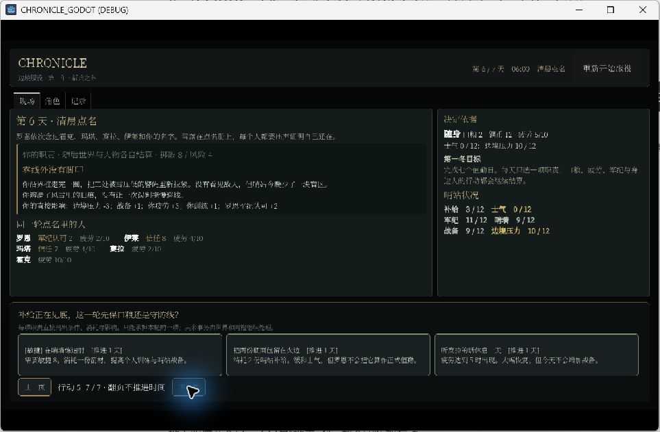
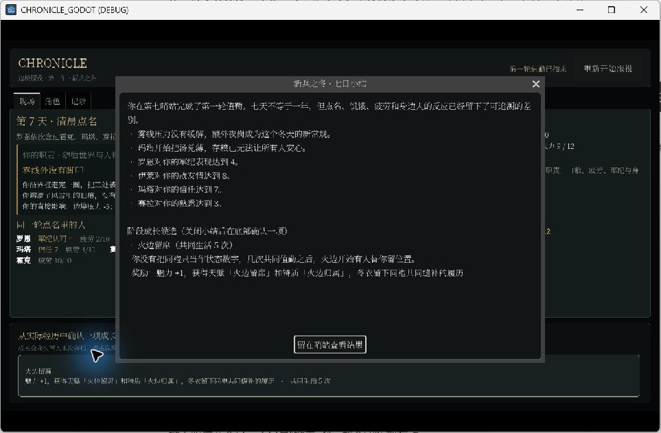

# 2026-09-05 整体审阅证据

对应 [项目整体审阅](../../../../../../../texts/v5/CHRONICLE_PROJECT_REVIEW_2026-09-05.md)。基线 `52de618`。生产代码未修改。

## 实际 UI 操作

使用 Godot 4.6.3、`gl_compatibility`，启动参数为 `--windowed --resolution 1440x900`。通过 Windows Computer Use 按当前截图逐次点击可见按钮，未调用游戏内部行动函数、未修改世界状态、未注入成功结果。桌面工具返回的截图为缩放后的窗口图，不能据此声称已测试了多个分辨率。

这是一轮目的明确的短时抽样，**不是高强度长时间自由游玩**。湖湾镇与哨站分别启动，未从湖湾镇通关转入哨站，也没有完成季度、年末与第二年。未记录随机种子，因此这些实际 UI 操作不声明为确定性重放。

### 默认湖湾镇

命令：`Godot_v4.6.3-stable_win64_console.exe --path chronicle-godot --rendering-method gl_compatibility --windowed --resolution 1440x900`

| 次序 | 实际操作 | 观察 |
| --- | --- | --- |
| 1 | 给陈米一份食物 | 时间 10:00 → 11:00；显示具体动作与食物减少，已帮助的行动退出当前候选 |
| 2 | 阅读涨价告示 | 时间到 12:00；展示具体告示信息，不再只写“记住关键信息” |
| 3 | 检查灰白粮粉 | 时间到 13:00；解释痕迹并开放粮仓路线；目标仍是指定调查步骤 |
| 4 | 走近陈米交谈 | 时间到 14:00；出现招呼反馈和同期世界变化；该招呼退出当前页，不能据旧图宣称一直不消失 |
| 5 | 前往废弃粮仓 | 时间到 18:00；消耗四小时与一份食物；现场只有返回路线和少量行动 |
| 6 | 检查门槛霉斑 | 时间到 19:00；显示危险与准备、进入等选项；未继续检定，不能评价此次风险结局 |

### 独立第一冬

命令在上述参数末尾追加 `res://scenes/rebuild/v5_seventh_outpost_viewer.tscn`。这是检查另一个正式场景，不代表默认路径已经支持任意生涯选择。

| 值勤日 | 选择 | 观察 |
| --- | --- | --- |
| 第 1 天 | 和玛塔核对口粮 | “两袋盐肉没有真正丢失”；行动补给 +2，再进行日结算 |
| 第 2 天 | 再次核对口粮 | 同样两袋盐肉与重复记账描述再次出现；第 3 天补给仍 8/12，但军纪等状态变化 |
| 第 3 天 | 陪伊莱练换弦 | “伊莱终于没有把弦扣打死”，描述“第一次主动等你同行”；战备与关系增加 |
| 第 4 天 | 再次练换弦 | 同样的第一次叙述再次出现；其他状态继续改变，说明不是画面没有刷新 |
| 第 5 天 | 巡查雾线 | 风险结算、疲劳与边境压力变化；疲劳达恢复条件 |
| 第 6 天 | 翻到第二页，休息一天 | 休息在行动第二页；疲劳恢复，补给和边境状况继续变化 |
| 第 7 天 | 巡查雾线 | 出现七日结算和一项本次经历满足的成长候选；未确认成长或进入季度 |

合计 13 次会推进游戏的实际操作，另有一次职责分页。能确认重复发现与重复首次描述，也能确认状态和关系并非完全不响应。不能从这个样本估计全部内容重复率或总体趣味性。









## 测试注入诊断

从仓库根目录运行：

```powershell
Godot_v4.6.3-stable_win64_console.exe --headless --path chronicle-godot --script res://texts/reports/2026/2026-9/2026-9-05/review_evidence/probe_material_boundaries.gd
```

脚本输出 `user://tests/2026-09-05_material_review_probes.json`，本目录保存其本轮副本 [material_review_probes.json](material_review_probes.json)。`probe_completed` 表示诊断完成，`reproduced` 表示构造的边界结果出现；**退出码 0 不是这些产品合同通过**。

四项均为测试注入：双用途选择同一物品、库存不足的整批消费、最旧需求候选覆盖后续需求、Market 直接调用的授权与 acquired 状态边界。候选诊断没有构造有资金有买家的完整市场，不用它声称自然采购饥饿已复现。首次运行诊断脚本因常量名 `Material` 与 Godot 原生类重名而解析失败，改为 `MaterialService` 后四项运行完成；游戏生产代码未改动。

## 历史证据勘误

本机保留的 `$env:TEMP/chronicle-operational-material-full/*render_test.stdout.log` 共 15 份，第二行均包含 `OpenGL API 3.3.0 ... Compatibility`。与 `tests/run_regression.ps1` 的 `--rendering-method gl_compatibility` 一致。因此上一轮“Vulkan”是报告元数据错误，不是本轮发现渲染测试未执行；已勘误，不重跑测试、不改变原通过数。

三十日性能引用的是 9 月 3 日已保存的 `industry_evidence/world_surface_profile.json`。七日单次消融只能描述那次运行，不能据此排除三十日不同阶段的累积成本来源。
