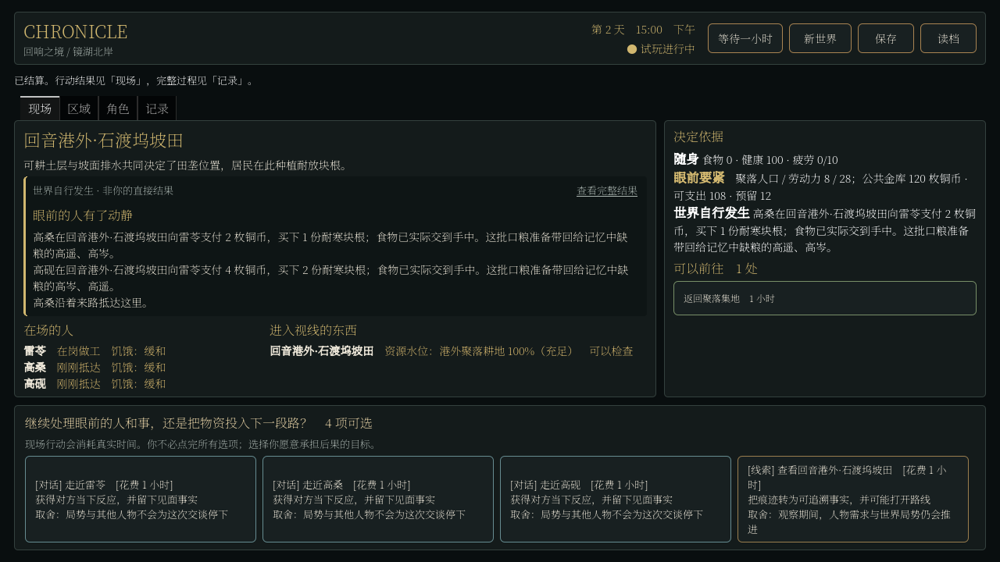
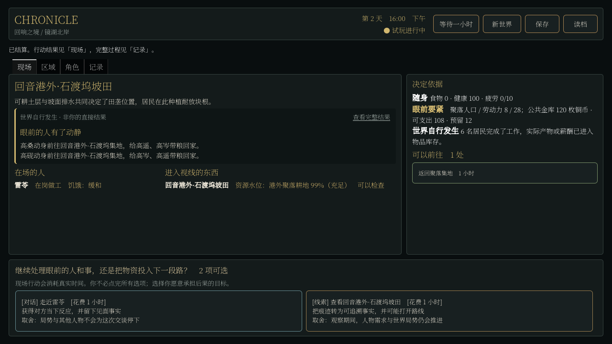

# 家庭需求、记忆与实物供给

日期：2026-09-06。工作基线 `1d544ee588b9919580b842f1fcd720c58667cc12`，分支 `codex/player-agency-world-surface`。归属 H2，原设定锚点仍为镜湖北岸回音港周边。本轮不新增城镇、势力或美术。

## 结果与判断

居民现在会因为记得同住者缺粮而采购和返家，帮助需要花自己的钱、占用真实工时，并把物品实际交给在场的人。收到帮助也会改变关系和记忆。这个变化接通了人物要素与世界行为，不是增加一条“照顾老人”的固定任务。

生活平衡没有全面改善。三个种子的七日总餐数分别增加 4、增加 1、减少 2，期末仍各有两人极饿。购物和送粮多了，并不等于整个世界更好地生活。新增动机暴露出工时、家庭支付能力和岗位用途的缺口，这些仍是 H2 的活动工作。

用户关于需求、性情、关系和记忆颗粒度的思路已写入[家庭供给合同](../../../../../../texts/v5/CHRONICLE_HOUSEHOLD_PROVISIONING_CONTRACT_v5.1.md)和唯一主计划。采用可组合、能改变行为的基础元素，不采用“堆积足够词条即可自动产生智能”的判断。本轮也没有实现完整人格或通用效用规划。

## 实际发生了什么

种子 81001，同一初始人口、资源、货币和时间，连续推进 168 小时，不发出代理人物行动或 NPC 指令：

| 人物 | 禁用家庭规则：餐数 / 工资 / 期末钱 | 新规则：餐数 / 工资 / 期末钱 |
| --- | --- | --- |
| 高桑，车夫 | 14 / 10 / 7 | 13 / 6 / 0 |
| 高砚，守夜人 | 14 / 8 / 11 | 11 / 8 / 0 |
| 高遥，退休同住者 | 0 / 0 / 0 | 5 / 0 / 0 |
| 高岑，退休同住者 | 0 / 0 / 0 | 3 / 0 / 0 |

工资和期末钱均为真实铜币。两名谋生成员合计购粮支出 20 铜币；高桑的工资少了 4，家中的两人吃到了 8 餐，但谋生成员合计少吃 4 餐。世界总餐数净增 4。照顾别人开始有实际代价，尚未形成可持续家庭预算。

可复现的其中一次行为发生在第 2 天：高桑记得高遥和高岑缺粮，从车场出发，经集地到坡田向雷苓买食物；之后经集地回家，实际交付，再由原有进食系统消耗。不是把饥饿直接改小，也没有增发食物或铜币。





两张图来自 1280×720 的真实 Godot Compatibility 渲染。程序只通过正式 UI 旅行与等待，未注入 NPC 行为。画面说明了为谁买、买什么、花多少钱和随后去向；不等于独立真人已觉得有趣。原有通用对话和重复选项仍不足以形成正式玩家玩法。

## 多种子对照

每个种子运行两个版本，唯一启停开关为家庭供给配置；初始世界、生产批次和货币相同。禁用组是测试注入对照，不称为玩家干预。七日指 168 个小时，初始时间是第 1 天 08:00，结束在第 8 天 08:00。

| 种子 | 总餐数：旧 / 新 | 极饿人时：旧 / 新 | 新版实物交付 | 其中源自购粮 | 新版期末食品 |
| --- | --- | --- | --- | --- | --- |
| 81001 | 193 / 197 | 356 / 313 | 26 | 8 | 271 |
| 82002 | 193 / 194 | 372 / 374 | 38 | 7 | 274 |
| 83003 | 193 / 191 | 370 / 398 | 25 | 6 | 277 |

所有组生产 468 份食品，`初始 + 产出 - 餐数 - 剩余 = 0`；铜币总量分别保持 301、288、279。每份家庭交付都可由后续进食引用，交付不全部来自购物，也包括生产者带回自有产物。新版的 9/13/12 次食物交易都发生在本聚落，不能据此宣称出现了新的跨镇贸易链。

保留了修正社会到场规则前的诊断组 `canon_family`：总餐数 193/193/191，极饿人时 357/384/394。诊断发现旧规则会远程还人情债、取用非债务人的同住者财物，并把未当面提出的求助记作失败。正式新版 `canon_family_final` 另外启用保存下来的 `social_presence_version: 1`，这些路径受实际到场和本人所有权约束。不能把最终改进全部归因于“记忆变多了”。

三种子结果不同，仍不能推出完整涌现或稳健收益：82002 的极饿人时略升，83003 的总餐数与极饿人时均恶化。尚未完成三十日、完整收入循环、跨镇利益冲突和真人试玩。

## 验证范围

- 新增家庭合同当前 85/85 通过，包括未见面不知道、记忆过期、远方改善不自动知情、再见面取消、同一路程不同性情、关系敌对、无款无货、断路、收粮者缺席或死亡、原生保存与续跑、远程偿还和非本人财物反例。
- 三种子正式版及同种子禁用对照均通过七日无代理运行、引用检查、原生保存/恢复和继续一小时的一致性。比较完整 Stores、会话、时间、随机数与日志，采用原生 JSON 精度；没有把编码类型差别当成行为差异。
- 81001 另从头重复运行七日，Stores、会话、时间、随机数与世界日志五部分均按原生 JSON 数据一致，见 `seed_repeat.json`。没有比较带创建时间的整个文件字节哈希。
- 正式 UI 采购与返家渲染已通过，截图已检查；没有新增面板，也没有把远处私宅的送粮过程直接显示给不在场的观察者。
- 完整常规回归含真实渲染 134/134 通过；不包含可选的三十日长期测试。源码进程级后台协议 8/8 通过。
- 无其他模拟任务并发时，新建/七日世界各 20 次合法普通行动，实际绘制完成的响应 P95 为 127/507 ms，最慢 140/524 ms，符合当前 16 人范围的 1 秒目标。机器为 i7-13700H、RTX 4060 Laptop、NVIDIA 596.36、Godot 4.6.3 Compatibility。不是多机或三十日性能验收，也不把历史样本差异算成本次优化百分比。
- Windows 包验证仍在本轮收尾流程中，未以旧版测试代替。

运行记录与离线审计在 `household_food_evidence/`。原生大存档保留在开发机 `user://tests/food_economy_probe/`，审计记录文件路径及 SHA-256，未将全部大存档重复提交仓库。

## 复现

在仓库根目录执行；Godot 4.6.3：

```powershell
Godot_v4.6.3-stable_win64_console.exe --headless --path chronicle-godot --script res://tests/sim/household_provisioning_contract_test.gd
Godot_v4.6.3-stable_win64_console.exe --headless --path chronicle-godot --script res://tools/food_economy_probe.gd -- canon_family_final 81001 7
Godot_v4.6.3-stable_win64_console.exe --headless --path chronicle-godot --script res://tools/food_economy_probe.gd -- canon_without_family 81001 7
Godot_v4.6.3-stable_win64_console.exe --path chronicle-godot --rendering-method gl_compatibility --script res://tests/rebuild/household_provisioning_render_test.gd
```

其余种子为 82002 和 83003。当前代码重新运行 `canon_family` 会使用当前新建配置，不用于还原历史中间版本；历史诊断需读取对应存档的已冻结配置和本报告证据。

## 下一项

继续 H2 的付款需求与家庭预算。现有车夫需 10 个在岗小时、守夜人需 12 个在岗小时才分别获得 2 铜币，且尚无完整的实际服务需求和持续付款来源。要把钱与岗位服务、物资用途及真正受益者连接起来，同时让人物能评估工作与采购的机会成本。不能仅增加工资、起始金库或免费粮来使统计好看。

无需为了这项工作新增大陆、种族词条或通用人格大重构。H3 的玩家人生、危险出行与可玩 Demo 仍未验收，本轮没有提高任何完成度百分比。
