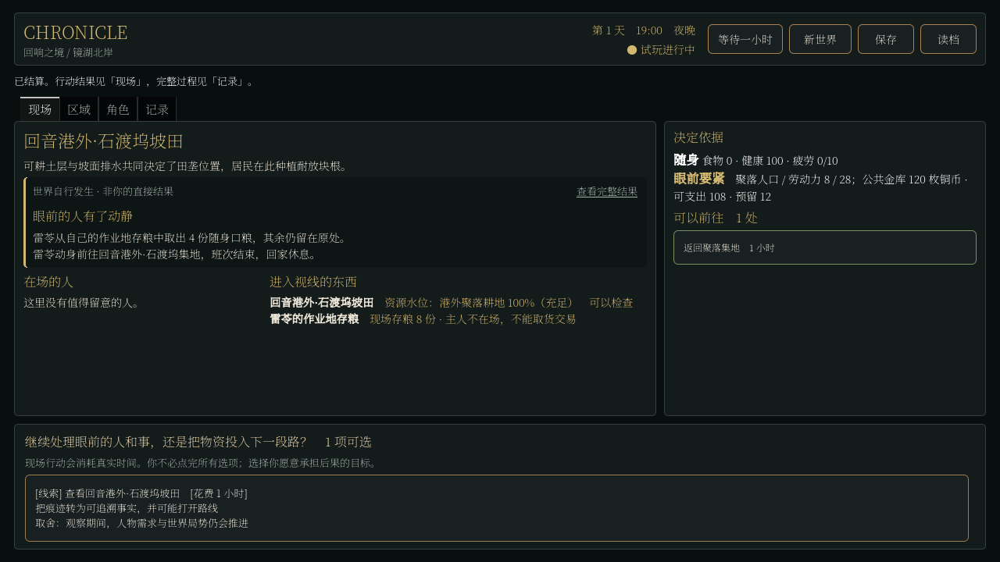

# 现场存粮、转运实验与失败结论

2026-09-06。起点提交 `91947dde522626051a869733b49d261c7cf6be9d`，分支 `codex/player-agency-world-surface`。本轮没有改变原设定地理、添加新美术、重写人格系统或宣布 H2 完成。

## 结论

完成了一个底层位置与所有权节点：产物能留在有主人的作业地库存，所有者离开后货物仍在原处；取粮和买卖要求到场，满库存让采收停止，腾出空间后恢复。转运也有真实进货、道路、付款、销售和进食合同。

但自然生活实验失败了。三个种子都没有形成运抵后的加价销售，仓储组合还加重了饥饿。因此不把这套配置变成默认世界。正常「新世界」保留前轮规则，候选通过后台显式实验入口开放。控制测试能执行一条链，不能证明世界自然需要它。

## 两轮因果修正

最初把车夫从计时工资改成自费收粮、运回集地出售。他们的本金来自已有个人铜币，没有初始补贴。无货、买不起、路不通、无人买都会阻止收入；原有守夜人工资没有借此宣称具备真实服务用途。

自然运行发现车夫启动资金小、往返期间需要进食与照料家人，而生产者自己携带所有余粮穿过集地。改成批量价、保留商业货物、在集地摆卖后，仍未产生运抵后的收益。部分原地转手确实收到钱，但不能冒充运输服务。

随后把初始食品生产者的成品写入原 ItemStore 内的粮堆持有者，明确所有者与位置。第一次在每次到场时装满口粮又触发了过早返家，削弱生产。修正为在岗按需取一餐、离岗前备家庭口粮，并处理拿最后一份口粮奔走和在家等待缺席收货人的问题。修正改善了该实验自身的结果，仍未恢复到原规则的生活水平。

## 七日无角色行动

均为回音港周边 16 人、种子 81001/82002/83003，168 次逐小时推进，初始钱与食物不增加。下表比较各自明确配置，不以测试注入代表玩家选择。

| 配置 | 81001 餐数 | 82002 餐数 | 83003 餐数 | 期末极饿人数 |
| --- | ---: | ---: | ---: | --- |
| 前轮家庭供给默认规则 | 197 | 194 | 191 | 2 / 2 / 2 |
| 自费转运，无现场粮堆 | 186 | 183 | 181 | 2 / 2 / 2 |
| 现场粮堆与转运组合 | 123 | 122 | 118 | 12 / 12 / 10 |

默认行来自前轮已归档同种子证据，不假称本轮重新跑过默认基线。自费转运行使用 `canon_carting_audit`；组合使用 `canon_depot_final`。早期 runner 的 `scope` 文本较泛，实验身份以保存的明确规则配置为准；当前 runner 已修正标签。

组合三种子分别生产 156/168/168 份，期末存粮 33/46/50 份；产量减去实际餐数恰好等于余量。铜币总量分别维持 301/288/279。真实食物采购成交 28/23/26 次，支付 139/98/92 枚铜币；其中没有一笔满足“买入、运至另一地点、卖出取得运费差额”的自然服务链。不能拿成交增加来抵消餐数下降。

极饿人时分别为 1102/1132/1178，而前轮默认为 313/374/398。库存存在不代表家庭可以取得，花钱发生也不代表足够的人有收入。三份原生存档均通过引用审计、磁盘恢复和继续一小时的完整原生精度状态比较；这证明保存连续，不证明经济健康。

## 验证与可见性

- 转运合同 54/54，仓储合同 32/32。覆盖本人钱、库存守恒、真实地点、断路、无款、缺席卖方、伪造仓位卖方、在途交易、积压停工、恢复生产、旧规则保留与原生续跑。均明确属于控制测试。
- 源码真实管道 10/10，包含显式仓储实验的开局、真实生产、取粮、存档恢复和非法配置拒绝。完整回归与最终 Windows 包记录在下方交付检查中。
- 1280×720 实际 Compatibility 渲染，观察者只执行合法旅行和等待。画面能看到粮堆余量与主人缺席，数据读取当前真实 ItemStore。
- 截图检查发现本轮新增优先级不被旧格式化器接受，粮堆一度只存在于视图数据。已回到原优先级，并增加实际 RichTextLabel 文本断言。没有把这个本轮缺陷写成历史 UI 原因。

这是程序驱动界面验证，不是独立人类试玩，不证明当前游戏好玩。现场仍缺玩家运输工作的正式选择，未增加可玩时长或完成参赛演示。

## 计划变更

保留有效的现场库存、权限、报价与事务机制；停止将自费倒卖作为默认谋生方案。合并到当前唯一 H2 项：先验证已有付款方因实际收货需求发出的有限运输委托，货物保管、到场交付和报酬必须共同结算。对比继续本人送粮、雇人运输、拒绝或无人承运，不再增加一个无真实需求的职业按钮。实施时还需解决家庭资金与工作时间的取舍。

这没有新开一套计划，也没有改动题材、期限或旧存档兼容政策。当前活动入口为 [世界优先计划](../../../../../../texts/v5/CHRONICLE_WORLD_FIRST_PLAN_v5.1.md)，机制边界见 [合同](../../../../../../texts/v5/CHRONICLE_WORKSITE_FOOD_AND_CARTING_CONTRACT_v5.1.md)。

## 交付检查

- 完整回归 137/137 个测试文件通过，包含实际渲染测试；原始结果见 [回归清单](worksite_food_evidence/regression_results.json)。转运、仓储和画面专项日志分别归档在同目录。
- 最终仓储配置的 81001 种子重新运行七日后，原生存档的 `stores/session/world_time/rng_states/world_log` 五部分均与首轮一致，见 [确定性重复](worksite_food_evidence/seed_repeat.json)。没有把保存时间戳当作世界状态。
- Windows 包将在本次运行时提交后重建，并执行独立进程协议测试和真实绘制启动检查；完成后追加结果，不以导出退出码代替实包运行。
