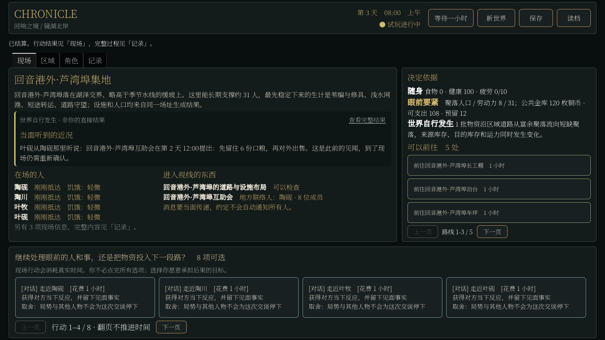

# RF4：消息、地方约定与实际生活

2026-09-09。运行时代码 `bff41af`，分支 `codex/player-agency-world-surface`。RF4 的 E2 有限组合验收通过：自然请求与实际援助、已知约定与真实拒绝形成不同传导，未获援助者有自给后的生活恢复，三种子三十日、关闭对照、原生续跑及实包检查完成。失败候选保留在 [联调记录](2026-09-09_rf4_community_working.md)。此结论不包括自然和解、完整协商或生活平衡。

## 实际改变

邻聚落的需要现在能改变一个具体居民的目的地、劳动和自有货物去向。人物须实际听到消息，选择是否帮忙，回货柜取粮，沿路运输；收货家庭再取粮、进食并记住出粮者。地方留粮约定能阻止一笔本来可承担的援助。没有固定某天触发、指定人物必须成功的剧情，也没有为本轮增加人口、钱粮或共享钱包。

这证明了有限的跨主体生活因果，不证明完整文明、复杂人格或玩家已经有足够好玩的选择。开启交往后，部分家庭的生活指标更差；地方生活仍为显式、默认关闭的实验。

## 自然三十日

三组都无代理行动、无 NPC 行为注入。两聚落各八名居民，沿镜湖北岸湖上自由民的已有设定生成地方互助会；不是新建两个国家。所有样本的钱币和成品食物账差均为零，原生保存、加载及继续一小时的完整状态一致。

| 种子 | 实际援助 / 粮食份数 | 实际跨镇买卖 | 规则阻止援助 | 总餐数 | 最少个人餐数 | 最长断餐 |
| --- | --- | --- | --- | --- | --- | --- |
| 81001 | 2 / 8 | 3 | 0 | 901 | 35 | 73 小时 |
| 82002 | 2 / 8 | 0 | 0 | 935 | 54 | 47 小时 |
| 85005 | 1 / 4 | 4 | 1 | 915 | 49 | 82 小时 |

85005 在规则冻结后才加入，没有再据它调整运行时代码。五次援助均为本人自送，没有运费收入，均有直接引用请求的选择、真实送达、家庭取粮和进食履历。自然世界中也有原有付费家庭托运；不能把全部托运都算跨镇援助。

证据：[81001](community_evidence/rf4_freeze1/canon_community_rf4_freeze1_81001.audit.json)、[82002](community_evidence/rf4_freeze1/canon_community_rf4_freeze1_82002.audit.json)、[85005](community_evidence/rf4_freeze1/canon_community_rf4_freeze1_85005.audit.json)。

## 两类传导

### 求助带来实物反馈

81001 中，陶砚亲见家中缺粮，消息在第 19 日传到雷苓。雷苓的决定直接引用该请求，改去自己的作业地；第 20 日 10:00 装出四份粮，18:00 实际送入陶砚家的粮柜。陶苓及陶砚后续进食的物品履历含这次交付。请求来自家庭 A，改变 B 的行动，实物再回到 A 的生活，不能仅用“发生过交谈”替代这一链。

可重查的请求是 `fact.community_observation.generated_resident.echo_landing.001.463.need`，听到请求为 `fact.community_message_heard.generated_resident.echo_terrace.001.470.0`，运输合同为 `exchange.food_haul.generated_resident.echo_terrace.001.generated_resident.echo_terrace.001.490`。

### 规则阻止发货，生活仍继续

85005 中，第 26 日叶遥同时听到雷澜家的请求和本地留粮约定。17:00 她检查自有余粮后拒绝发货，未划走粮食或钱，之后回到工作和自家备粮。原始拒绝事实为 `fact.community_aid_withheld.generated_resident.echo_landing.005.641`，直接引用两条当面消息 `...640.0` 和 `...640.1`。

没有得到援助承诺的雷澜继续按自己的缺粮和真实询价失败寻找出路，第 27 日在公用坡田劳动四小时取得四份块根，14:00 自己吃一份，16:00 带回家让雷禾吃到。这是原有作业、资源消耗、运输和家庭分享的恢复路径，**不是听到拒绝回信后改变主意，也不是双方已经和解或恢复了援助**。生产事实 `fact.npc_livelihood.generated_resident.echo_terrace.005.echo_port_environs_v1_time_628` 被后两次进食直接引用。

为区别“只是刚好同时发生”和真正的规则约束，另从同一自然存档重放到拒绝时刻。对照仅在本次受理中忽略已经听到的约定，使用原来的请求、本人粮食、身体、道路和运输机制；明确记录 `test_injection.disregard_known_policy.641`，不称为自然行为或玩家选择。结果四份粮实际送达。随后两个分支都自然推进 24 小时：总餐数同为 796，但收货家庭的雷岑少做一轮采食，铜币由 4 变为 0，雷桑和雷禾的手持粮各由 0 变为 1；出粮者的行程和余粮也不同。

这说明约定确实改变了物流与后续取舍，不能推出忽略约定让每个人都更好。见 [保留约定分支](community_evidence/refusal_baseline.json)、[测试注入分支](community_evidence/refusal_disregard_policy.json)，重放工具为 `tools/community_refusal_replay.gd`。两分支仍保持钱粮守恒。自然样本中相同援助关系拒绝后的重新成交次数为零，完整协商与拒绝回信仍未实现。

## 同源关闭对照

主冻结组固定 81001 初始人物、资源、货物和钱，只关闭一类机制。关闭配置有明确测试注入事实，不混进自然样本。

| 配置 | 三十日餐数 | 跨镇援助 | 跨镇买卖 | 最长断餐 |
| --- | --- | --- | --- | --- |
| 全部开启 | 901 | 2 | 3 | 73 小时 |
| 不传递消息 | 950 | 0 | 0 | 38 小时 |
| 不产生地方约定 | 935 | 0 | 2 | 47 小时 |
| 不进行交往 | 951 | 0 | 0 | 32 小时 |

额外的 85005 关闭约定三十日对照为 939 餐、6 次援助、1 次跨镇买卖、最长断餐 69 小时；开局相同，不为该种子重新调参。早期七日关闭约定时却没有援助，不能从一个时段的零事件推断机制永远无效。整段关闭对照包含行程和见面机会的累积变化，局部拒绝的直接作用以上述同一时刻的成对验证为准。

**新机制没有被证明提高生存质量。** 不传话组更容易吃到饭，反映交往和远行占用了原有生计时间。最差断餐分别出现在陶苓、林苓和杜桑这些被抚养者身上。后续应检查照护承诺与长程活动的竞争；不能增加免费粮食掩盖，也不能用总餐数遮住具体孩子的处境。

## 验证和交付

- 完整回归 151/151，通过 127 项非渲染及 24 项实际渲染检查，测试用时合计 786.67 秒。
- 新援助专项 86 项通过：未知请求、实际到场、真实存粮与运费、道路不可达、已知留粮拒绝、收货、关系记忆、在途存档和完整原生续跑。普通付费运输仍须非零运费；自送严格限定同一出粮人和承运人。
- 源码后台接口 13/13，通过用时 72.149 秒。独立 `Chronicle.exe` 后台接口 13/13，通过用时 45.715 秒。
- 干净源码 `bff41af` 导出 Windows 包，实际启动通过。新三十日世界首次可控绘制约 6.79 秒，旧三十日存档约 4.44 秒；初始和旧七日约 1.97 / 2.49 秒。同一开发机，没有清空系统缓存，不称为独立电脑兼容性验收。
- Godot 720p / 900p 实际绘制显示完整的一条近期消息，并保留可达的行动栏；完整经过进入现有记录页，没有为新内容增加滚动小框。没有进行独立人测，不宣称 UI 或游戏性通过。

包位于 `builds/h1-windows/Chronicle.exe`，启动后在「新世界」显式勾选「地方生活实验」，或后台指定 `economy_variant="community_life_v1"`。旧存档不会静默启用该规则。[构建指纹](community_evidence/build_manifest.json)、[全部回归](community_evidence/regression_freeze1/results.json)、[新存档实包](community_evidence/package_community_day30.json)、[旧存档实包](community_evidence/package_legacy_day30.json)。

## 最终边界

主冻结组六组各三十日全部完成，运行时前后哈希一致，见 [执行结果](community_evidence/rf4_freeze1/results.json) 与 [冻结指纹](community_evidence/rf4_freeze1/runtime_manifest.json)。此外完成 85005 的七日和三十日关闭约定对照，以及自然拒绝时刻的成对重放。运行时冻结后没有改动；只完善了审计器对直接决策来源与宽泛历史关联的区分，重算早期审计不重跑模拟。完整历史祖先可能穿过混合粮堆、铜币及之后的交易，因此它只是追查入口，不是“某条消息改变了这么多餐”的定量证明。

后续仍按原计划进入 RF5 的实体危险、NPC 遇险、连续战斗、受伤和恢复集成，再由 RF6 把玩家放入这一世界。原有战斗模块目前仍主要处理玩家短遭遇，不能把旧检定测试算作 NPC 连续战斗已完成。地方互助本轮不扩成国家政治，也不据此提前宣称参赛 Demo 完成。
